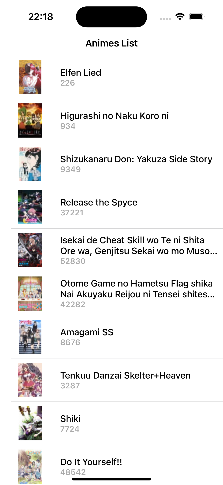
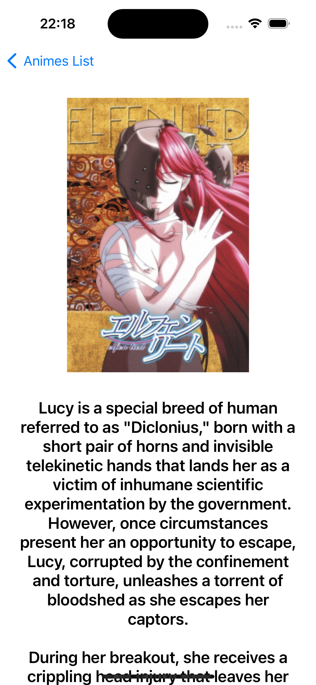

# Discovery Animes App

## Screenshots 📱

  
  
  

## Requisitos
- Utilizar a linguagem swift, UIKit, StoryBoard, XIB e ViewCode. Utilizar ao menos uma lib do Cocoapods e possuir no mínimo 3 telas.

## Descrição
- Aplicativo com o intuito de descobrir animes que são bem avaliados e que estão em alta na internet.
