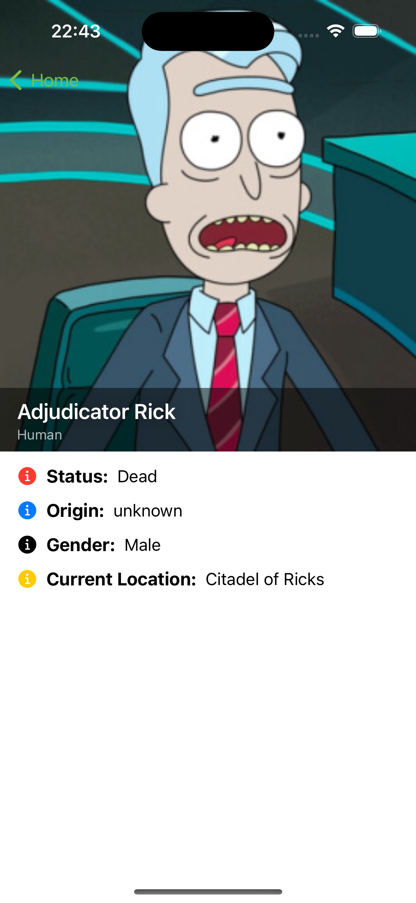

# Rick And Morty App SwiftUI

## Screenshots 📱

  
  
  

## Requisitos
- Utilizar SwiftUI, Combine e uma dependencia gerenciada pelo Swift Pack Manager.

## Descrição
- Aplicativo que apresenta os personagens do Sitcom Rick and Morty e descreve informações sobre eles.
