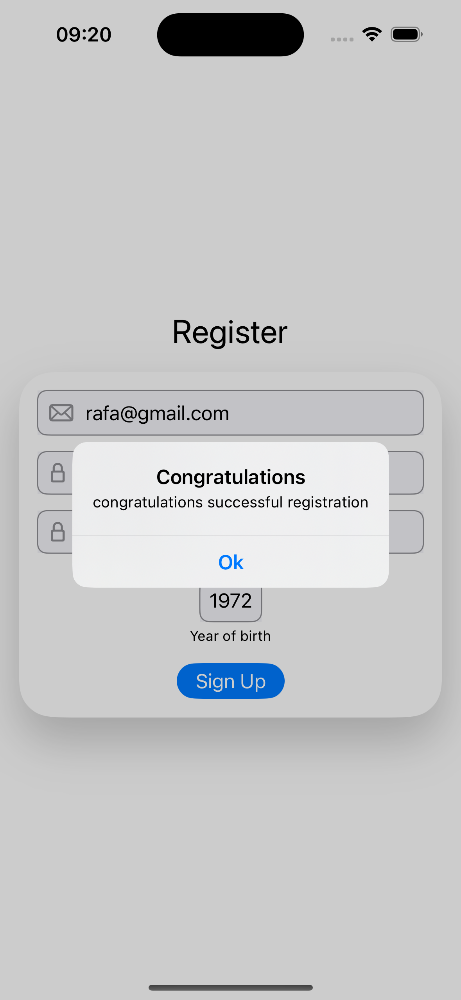

# Register Screen with validation and modularization

## Screenshots 📱

  
  

## Requisitos
- Utilizar modularizaçao com CocoaPods, criando um módulo principal e outro que tenha informações necessárias para o módulo principal.

## Descrição
- Aplicativo com uma tela de registro onde os componentes do formulário são disponibilizados por um módulo a parte.
